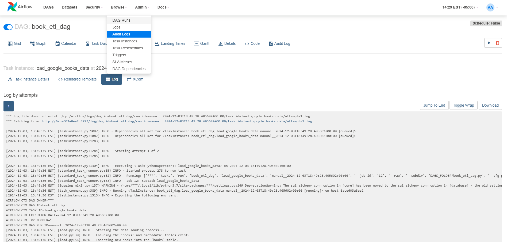
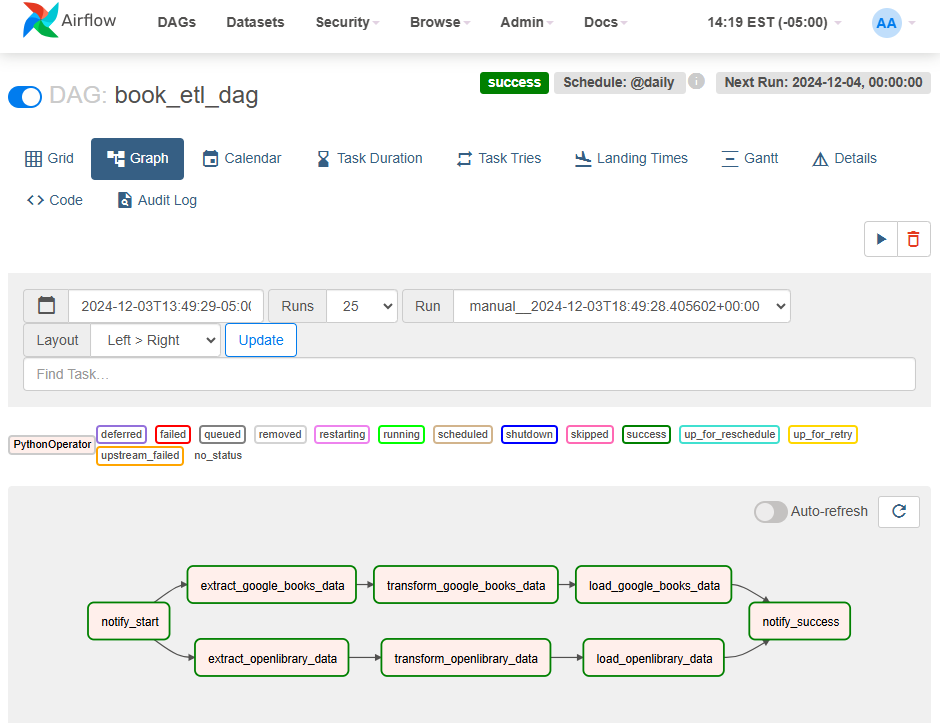
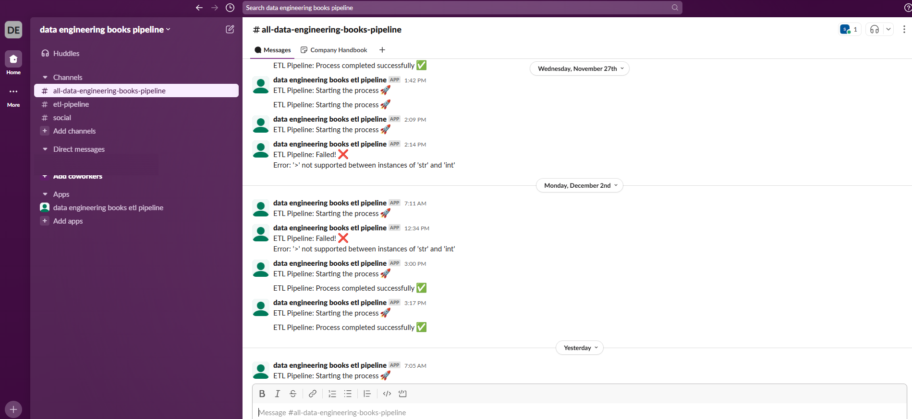
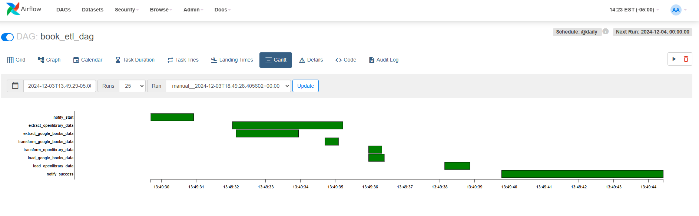
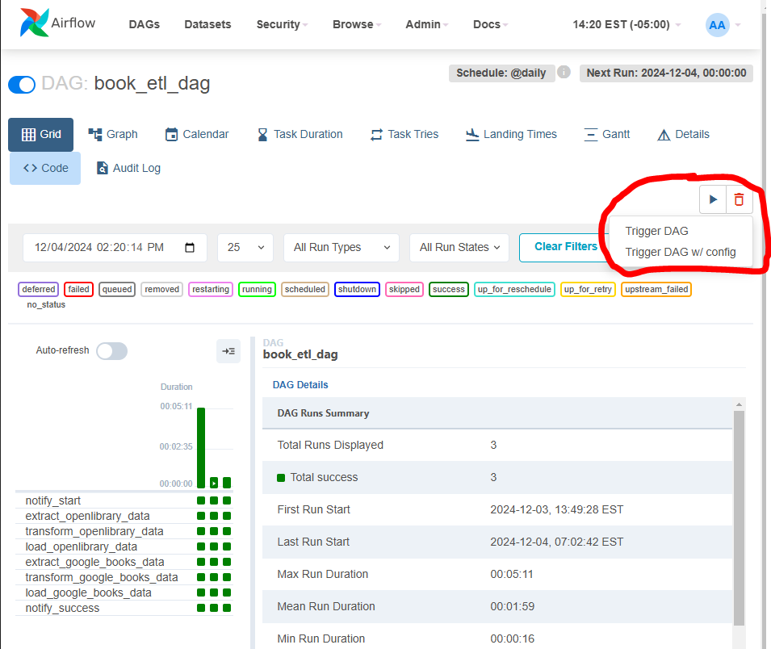
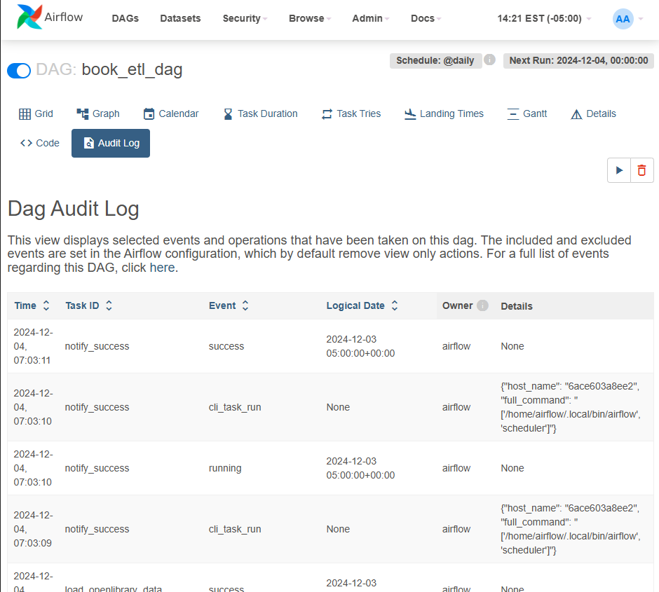
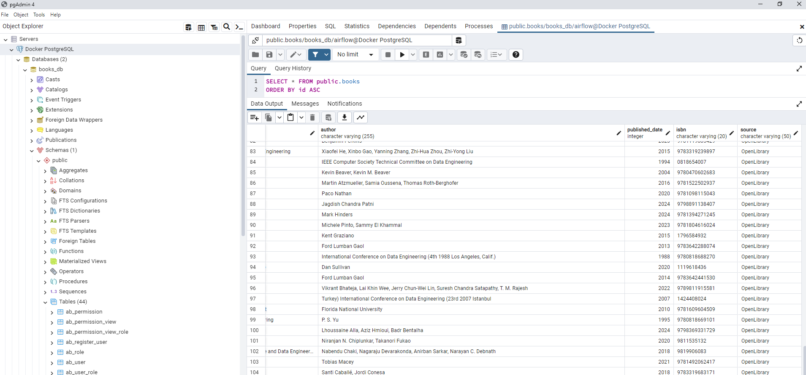

# 📜 A Proclamation Regarding the Noble Data Engineering Books ETL Pipeline Project! 📜
## 🌟Overview
Greetings, kind scholars and brave data wranglers! Lend thy ears and open thine eyes, for I shall regale thee with the tale of a most wondrous endeavor: the Books ETL Pipeline Project. In this hallowed pursuit, we dost weave together the intricate threads of data extraction, transformation, and loading to uncover knowledge most profound.

This grand mechanism, devised by tireless toil and wisdom, doth unite the realms of Python, Docker, PostgreSQL, and Airflow. By its might, one may harvest bookly treasures from the vast libraries of OpenLibrary and Google Books, cleanse and refine them, and store them in databanks for enlightenment and analysis.

Lo, this project is not merely a tool but a masterwork that doth exemplify the art and science of data engineering. Scholars, practitioners, and seekers of wisdom alike may find value herein, as it is both a tome of learning and a marvel of modern craft.

Thus, embark, good reader, upon this journey of discovery, and let the annals of data yield their secrets unto thee!

## 📜 Of Purpose, Intention, and Worthy Usage 📜
Hark! This noble endeavor is fashioned to fetch and hold knowledge, tracking the comings and goings of books upon the digital shelves. But lo! Its utility extendeth far beyond the boundaries of this humble purpose. Prithee know, fair user, that **thou mayest adapt its workings to suit thine own curiosities.** By a simple **tweak of query**, *thou mayest turn this engine toward thine own pursuits*—be it tracking wares, scrolls, or other matters of great import. Wield this tool as thy will decrees, and may it serve thee well in thy noble quests!

## 🖼️ BEHOLD! The Diagrammatic Depiction of the ETL Pipeline 🖼️
Hear ye, hear ye! Gather thy gaze upon this most wondrous depiction of the grand ETL pipeline!

Within its bounds, thou shalt witness the harmonious interplay of myriad parts, each a vital cog in this celestial mechanism. From Security Sanctuaries to ensure the sacred safety of thine operations, to the Testing Grounds whereupon thy code is proven and hardened, this diagram illustrates the majestic flow of data, transformed from its humble JSON origins into a regal table of fields—fit for analysis and insight.


🔒 **Security:** Lo, the bastions of access control and protection, ensuring no ill-begotten hand may meddle with the data's purity.

🧪 **Testing:** Prithee, regard this as the proving grounds where robustness is forged, where bugs are vanquished, and the pipeline stands resilient.

🐳 **Docker Enclosure:** Witness the orchestration of containers, wherein each component dwelleth in isolation yet communicateth with precision, making the entire pipeline agile and portable.

📤 **Data Extraction:** Here lieth the cradle of our endeavor, whence data is lifted from its JSON confines and set forth upon its transformative journey.

🛠️ **Data Transformation:** The alchemy of the pipeline! Fields are cleansed, shaped, and readied for their destined purpose. Here, titles, authors, years, and sources are refined into their final glorious forms.

📊 **Final Table:** The culmination of all labors! Behold the tabular majesty, wherein the fruits of thy efforts—titles, authors, publication years, and more—stand ready to enlighten thy endeavors.

🎩 **Airflow Sorcery:** Marvel at the enchanted scheduler, tirelessly orchestrating the pipeline's every step with grace and precision.

*Here, in this tableau of wisdom, the ETL process cometh alive. Gaze upon its intricacies, for herein liest not just a method but a marvel, where chaos is tamed and knowledge is borne.*

## ✨ Features of Noble Craft
- 🛠️ **Extraction of Many Founts:** Gathers knowledge from the OpenLibrary and Google Books APIs, like a wise scholar pulling treasures from ancient tomes.
- 🧹 **Purification of Data:** Cleanseth and enriches the raw information, ensuring it is fair and fit for study.
- 📊 **Integration with the Repository of Postgres:** Deposits the bounty into a steadfast database for safekeeping and recall.
- 🛡️ **Defenses and Logging of Errors:** Implements vigilant sentinels to guard against mishaps and record the chronicles of the pipeline.

- ⏰ **Automation of Timely Tasks:** Employeth the magic of Airflow to schedule thy tasks, ensuring they commence with precision.

- 📩 **Slack Heraldry:** Dispatches messengers to announce the state of thine efforts in real-time.

- 📦 **Encasement in Docker’s Vessel:** Encircles the pipeline in the aegis of Docker for deployment and scaling to lands far and wide.

---
## 🏗️ The Grand Architecture
### 🧩 Components of Ye ETL Pipeline
1. **🔍 Extraction:**

- Summoneth data from OpenLibrary and Google Books 📡.
- Handles peculiarities of pagination and rate limits, like a skilled juggler with flaming torches.
2. **🔄 Transformation:**

- Cleanseth and standardizes the records 🧼.
- Resolves missing fields and maketh the data ready for usage.
3. **📥 Loading:**

- Deposits the enriched bounty into Postgres’ eternal vaults 💾.
- Employeth conflict resolution to smite duplicate entries.
4. **🌀 Orchestration:**

- Commands the dance of tasks through an Airflow DAG ♻️.
- Schedules and retries with the wisdom of experience 🕒.
5. **🐳 Containerization:**

- Packages all components within Docker's might vessel 🌍.
- Uses Docker Compose to steer the ships 🎛️.
6. **🔔 Monitoring:**

- Announceth pipeline statuses via Slack 📲.
- Airflow's interface reveals all activity 📋.

## 🚀 For the Journeyman Getting Started
### ⚙️ Preparations for Thy Quest
- 🐳 Docker & Docker Compose
- 🐍 Python 3.8 or above
- 📜 requirements.txt should provide thee with required Python incantations
- 🔐 Slack Token, should thou seek notifications
- 🛠️ Basic wit in SQL and Python

## 📥 Commencement of Deployment
1. **Cloneth the repository:**

    ``` bash
    git clone https://github.com/VBlackie/books_etl.git
    cd Books_ETL_Pipeline
2. **Declare Thy Secrets:** Create a .env file with:

    ```
    SLACK_API_TOKEN=<your-slack-api-token>
    POSTGRES_USER=airflow
    POSTGRES_PASSWORD=airflow
    POSTGRES_DB=books_db
3. **Raise Thy Docker Containers:**

    ```
    docker-compose up --build
4. **Enter the Interface of Airflow:**

    - Navigate to http://localhost:8080.
    - Credentials:
    Username: admin
    Password: admin

## 🛠️ Usage of This Mechanism
- Command Thy Pipeline through the hallowed Airflow UI 🌀.

- Monitor Thy Logs with diligence for assurance 📜.

- Query Thy Database and unearth its treasures:
Should thou prefer the sanctity of pgAdmin4:


- Connect unto the database with the following credentials:
    - Host: localhost
    - Port: 5433
    - Username: airflow
    - Password: airflow
    - Database Name: books_db
  
Alternatively, should thou be inclined to use the command line:

    ```
    psql -h localhost -p 5433 -U airflow -d books_db
## 📂 Project Structure
    ```
📁 Books_ETL_Pipeline/
├── 📂 dags/
│   ├── book_etl_dag.py         # DAG of Airflow  
│   ├── extract.py              # Gatherer of Data from OpenLibrary
│   ├── extract_from_google.py  # Gatherer of Data from GoogleBooks
│   ├── transform.py            # Purifier of Records  
│   ├── load.py                 # Depositor of Information
│   ├── slack_notifications.py  # Herald of Notifications
├── 📂 logs/                    # Chronicles of Airflow  
├── 📂 plugins/                 # Custom Enhancements  
├── 📂 tests/                   # Realm of Testing and Validation  
│   ├── test_extract.py         # Examiner of Gatherer Logic  
│   ├── test_transform.py       # Scrutinizer of Data Purification  
│   ├── test_load.py            # Overseer of Data Deposition
│   ├── test_etl_pipeline.py    # Examiner of Integrity
├── 🐳 docker-compose.yml        # Configuration of the Fleet
├── 📜 requirements.txt        # The Scroll of dependencies
└── 🌐 .env                     # Hidden Secrets

## ⚠️ Known Issues and Their Vanquishment
1. **Scheduler Heartbeat Falters 🛠️:**

- Ensure Airflow volumes are intact.
- Use docker system prune -f to cleanse thy setup.
2. **SQL Insert Woes 🔄:**

- Ensure table schema matches the load.py script.
3. **Log Vanish into the Ether 🧐:**

- Verify mappings in docker-compose.yml
## 🎯 A Roadmap of Future Glories
- 🌐 Extend support to Goodreads or others.
- 📈 Bind the pipeline with Metabase for noble visualization.
- 📊 Enhance metadata reporting.
- 🚀 Embrace CI/CD for automated testing.

## 🤝 The Spirit of Fellowship
Contributions are welcome! Sharpen thy code and submit thy Pull Requests. Together, let us make this project legendary 🌟.
## 📜 License
This project is bestowed under the MIT License. It is free to use, modify, and cherish.